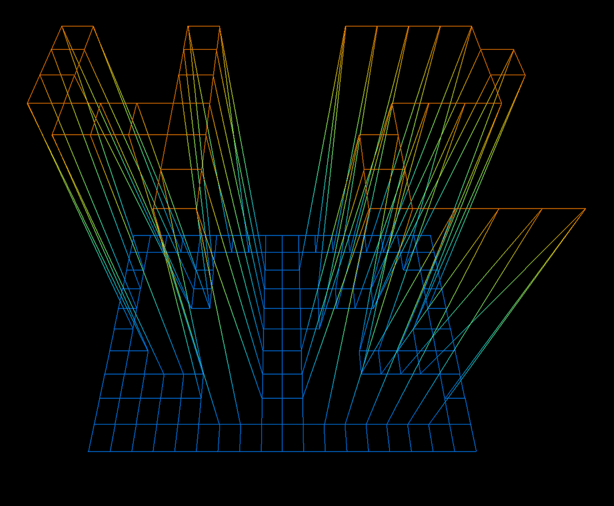

# fdf
This project contains two directories, includes and src. Includes holds the necessary libraries to run the code in src.
Those libraries are libgfx, minilibx, and libft.
## Libraries

### libgfx

### libft

### minilibx

## Source Files

### main

### parse_file

### draw_map

## How to Run
